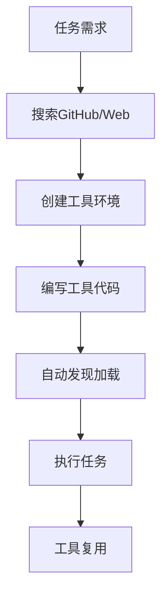

# AgentByAgent - 自进化动态工具代理系统

**问题描述：**
目前的 AI Agent 大多依赖于预先定义好的工具集，这限制了它们处理开放、复杂任务的灵活性和扩展性。当遇到一个没有现成工具可以解决的问题时，Agent 往往会束手无策。

本课题的目标是构建一个具备"自进化"能力的 Agent，它能够根据任务需求，自主地创造和集成新的工具。我们借鉴 Alita 论文 ([Alita: Generalist Agent Enabling Scalable Agentic Reasoning with Minimal Predefinition and Maximal SELF-EVOLUTION](https://arxiv.org/pdf/2505.20286)) 的思想，即"最小化预定义，最大化自进化"。

你需要构建一个 Agent，它不依赖庞大的预置工具库。当遇到一个新任务时，Agent 需要能：
1.  **理解任务需求**：分析任务，判断是否需要新的能力/工具来完成。
2.  **搜索解决方案**：在开源世界（如 GitHub）中搜索相关的库或 API 来实现所需功能。
3.  **学习和集成**：阅读文档或代码示例，学习如何使用找到的库/API，并动态生成代码来调用它，从而"创造"出一个新的工具。
4.  **执行任务**：利用新创造的工具来解决问题。

**验收标准：**
Agent 能够完全自主（fully autonomous）地为下列至少一个任务创造工具并成功执行，没有成功也不能产生幻觉。Agent 需要是通用的，不允许为特定问题硬编码工具或 workflow。

**场景一：YouTube 视频内容理解**
- **任务**：给定一个问题："In the YouTube 360 VR video from March 2018 narrated by the voice actor of Lord of the Rings' Gollum, what number was mentioned by the narrator directly after dinosaurs were first shown in the video?"
- **Agent 执行流程（参考）**：
    1. Agent 分析出需要获取 YouTube 视频的字幕。
    2. Agent 自主上网搜索，找到一个合适的 Python 库。
    3. Agent 阅读该库的用法，编写 Python 代码来下载指定视频的字幕。
    4. Agent 分析字幕内容，找到问题的答案。
- **验收**：Agent 输出正确答案 "100000000"。

**场景二：实时金融数据查询**
- **任务**：给定一个问题，例如 "What is the latest stock price of NVIDIA (NVDA)?"
- **Agent 执行流程（参考）**：
    1. Agent 分析出需要查询实时股票价格，这需要调用一个金融数据 API。
    2. Agent 自主上网搜索，找到一个免费的股票数据 API 并学习其文档。
    3. Agent 编写代码，根据 API 要求（可能需要注册获取免费 API Key）调用该 API，查询 NVDA 的最新价格。
    4. Agent 解析 API 返回结果，提取出价格信息。
- **验收**：Agent 输出 NVDA 的最新股价（允许有微小延迟或数据源差异）。

**加分项：**
- **工具的复用与管理**：Agent 能够将一次性创造的工具（例如"YouTube 字幕获取器"或"股票价格查询器"）保存下来。当未来遇到相似任务时（例如查询另一个视频或另一支股票），能够直接复用已有的工具，而不是重新创造。
- **鲁棒性处理**：Agent 创造的工具在执行时可能会遇到各种错误（例如 API key 失效、网络问题、库版本不兼容等），Agent 能够理解这些错误并尝试修复，例如重新搜索别的库/API。

---

## 🚀 核心实现 - 动态MCP服务器架构

本项目实现了一个高度模块化、可自进化的动态MCP（Model Control Protocol）服务器，为AI Agent提供强大的工具创建、管理和执行能力。

### 🎯 系统架构特性

#### 1. **动态工具加载系统**
- **实时扫描**：自动监控 `tools/` 目录，动态发现和加载新工具
- **智能缓存**：只在工具调用时重新加载当前被调用的工具，提高性能
- **模块隔离**：每个工具模块独立加载，避免相互影响

#### 2. **独立环境管理** 🔧
- **虚拟环境隔离**：每个工具在独立的Python虚拟环境中运行
- **依赖自动管理**：自动读取 `requirements.txt` 并安装依赖包
- **环境冲突避免**：彻底解决不同工具间的依赖冲突问题

#### 3. **进程代理机制** 🔄
- **跨进程通信**：通过子进程调用独立环境中的工具
- **元数据保持**：完整保留工具的签名、参数和文档信息
- **错误传播**：完善的错误捕获和传播机制

#### 4. **智能变更检测** 📊
- **实时监控**：检测工具文件变更并记录详细差异
- **版本对比**：提供新增、修改、删除工具的详细对比信息
- **变更历史**：维护完整的工具变更历史记录

#### 5. **可扩展中间件架构** 🛠️
- **动态工具中间件**：在工具调用前自动刷新相关工具
- **时间监控中间件**：详细的性能监控和时间统计
- **错误处理中间件**：统一的错误处理和异常管理
- **结构化日志中间件**：完整的操作日志记录

---

## 📦 功能模块详解

### 🎯 核心组件

#### 1. **DynamicToolLoader** - 动态工具加载器
```python
class DynamicToolLoader:
    - 扫描 tools/ 目录下的子目录
    - 使用 ToolEnvironmentManager 管理虚拟环境
    - 通过 ToolProxyManager 创建工具代理
    - 动态注册工具到MCP服务器
```

#### 2. **ToolChangeManager** - 工具变更管理器
```python
class ToolChangeManager:
    - 检测工具的增删改操作
    - 提供详细的差异对比功能
    - 维护变更历史记录
    - 支持变更摘要查询
```

#### 3. **ToolEnvironmentManager** - 环境管理器
```python
class ToolEnvironmentManager:
    - 为每个工具创建独立虚拟环境
    - 自动安装工具依赖
    - 管理Python解释器路径
    - 处理环境创建和维护
```

#### 4. **ToolProxyManager** - 代理管理器
```python
class ToolProxyManager:
    - 创建工具执行代理
    - 处理进程间通信
    - 管理代理生命周期
    - 序列化/反序列化参数
```

### 🛠️ 内置工具集

#### 1. **GitHub搜索工具** (`search_github`)
- **功能**：搜索GitHub上的Python项目
- **参数**：查询关键词、结果数量、排序方式
- **返回**：包含stars、forks等信息的仓库列表
- **应用**：帮助Agent发现相关开源库和API

#### 2. **AI增强网络搜索** (`advanced_web_search`)
- **功能**：使用OpenAI API进行智能网络搜索
- **特性**：AI分析和整理搜索结果
- **支持**：中英文查询，智能问答
- **应用**：获取最新技术信息和解决方案

#### 3. **工具环境创建器** (`create_tool_environment`)
- **功能**：自动创建新工具的完整环境
- **包含**：目录结构、虚拟环境、依赖文件、模板代码
- **验证**：工具名称格式检查
- **应用**：快速搭建新工具的开发环境

#### 4. **工具管理工具**
- `get_tools_changes()`: 获取工具变更信息
- `refresh_tools()`: 手动刷新工具目录
- `get_server_status()`: 查看服务器状态信息

### 🔌 扩展功能

#### 1. **远程MCP服务器镜像**
- 自动连接远程MCP服务器 (`http://127.0.0.1:8931/sse/`)
- 镜像远程工具到本地服务器
- 提供统一的工具访问接口

#### 2. **Claude代码工具集成**
- 集成 `mcp-claude-code` 服务器
- 支持代码执行和文件操作
- 限制访问路径确保安全性

#### 3. **实时通信协议**
- **SSE传输**：支持服务器发送事件协议
- **实时更新**：工具变更实时通知
- **高性能**：异步处理，支持并发访问

---

## 📁 项目结构

```
AgentByAgent/
├── dynamic_mcp_server.py          # 🚀 主服务器文件
├── config.json                    # ⚙️ 配置文件
├── requirements.txt               # 📦 依赖列表
├── README.md                      # 📖 项目文档
└── tools/                         # 🛠️ 工具目录
    ├── __pycache__/               # Python缓存
    ├── tool_env_manager.py        # 🔧 环境管理器
    ├── tool_proxy.py              # 🔄 工具代理管理器
    ├── tool_execution_script.py   # ⚡ 工具执行脚本
    ├── tool_loader_script.py      # 📂 工具加载脚本
    ├── logger_config.py           # 📝 日志配置
    ├── json_patch.py              # 🔨 JSON补丁工具
    └── test_tool/                 # 🧪 测试工具示例
        ├── tool.py                # 工具实现
        ├── requirements.txt       # 依赖配置
        └── venv/                  # 虚拟环境（自动创建）
```

---

## 🚀 快速开始

### 1. **环境准备**
```bash
# 安装依赖
pip install -r requirements.txt

# 配置OpenAI API
# 编辑 config.json 文件
```

### 2. **启动服务器**
```bash
python dynamic_mcp_server.py
```

### 3. **服务器信息**
- **协议**：SSE (Server-Sent Events)
- **地址**：`http://0.0.0.0:3001/sse/`
- **工具目录**：`./tools/`

### 4. **创建新工具**
```python
# 使用内置工具创建新工具环境
create_tool_environment(
    tool_name="my_new_tool",
    requirements=["requests", "beautifulsoup4"],
    template_content="# 你的工具代码"
)
```

---

## 🎯 自进化能力实现

### 💡 工具自动发现
1. **需求分析**：Agent分析任务需求
2. **搜索解决方案**：使用 `search_github` 和 `advanced_web_search`
3. **环境创建**：使用 `create_tool_environment` 创建新工具
4. **自动集成**：系统自动发现并加载新工具

### 🔄 动态工具生命周期


### 📈 核心优势

1. **🔒 完全隔离**：每个工具在独立环境中运行，避免冲突
2. **⚡ 高性能**：智能缓存和异步处理
3. **🔄 动态更新**：无需重启即可添加新工具
4. **📊 智能监控**：完整的变更检测和日志系统
5. **🛡️ 错误隔离**：工具错误不会影响主服务器
6. **🔧 易扩展**：模块化设计，易于添加新功能

---

## 🎉 总结

本项目成功实现了一个**高度模块化、可自进化**的动态MCP服务器，为AI Agent提供了强大的工具创建和管理能力。通过独立环境隔离、进程代理机制和智能变更检测，系统能够安全、高效地支持Agent的自进化过程，真正实现了"最小化预定义，最大化自进化"的目标。

🔗 **Ready for Agent Evolution!** 🚀 