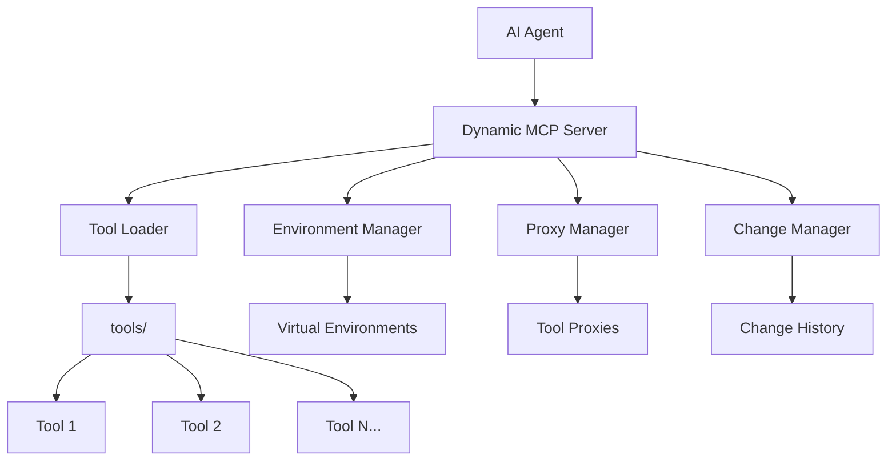

# AgentByAgent

<div align="center">


</div>

### 🚀 项目简介

AgentByAgent 是一个基于 [Model Context Protocol (MCP)](https://modelcontextprotocol.io/) 的自进化动态工具代理系统。它允许 AI Agent 根据任务需求自主创建、集成和管理工具，实现真正的"最小化预定义，最大化自进化"。

### ✨ 核心特性

- **🔧 动态工具加载**：实时监控工具目录，自动发现和加载新工具
- **🔒 环境隔离**：每个工具在独立的 Python 虚拟环境中运行，避免依赖冲突
- **⚡ 智能缓存**：只在工具调用时重新加载相关工具，提高性能
- **🔄 自动发现**：支持 GitHub 搜索和 AI 增强的网络搜索
- **📊 变更追踪**：实时检测工具变更并记录详细差异
- **🛡️ 错误隔离**：工具错误不会影响主服务器稳定性
- **🌐 实时通信**：基于 SSE 协议的实时工具更新推送

### 🏗️ 系统架构



### 📦 安装

#### 前置要求
- Python 3.8+
- pip

#### 克隆仓库
```bash
git clone https://github.com/your-username/AgentByAgent.git
cd AgentByAgent
```

#### 安装依赖
```bash
pip install -r requirements.txt
```

#### 配置设置
编辑 `config.json` 文件：
```json
{
    "openai": {
        "api_key": "your-openai-api-key",
        "base_url": "https://api.openai.com/v1/"
    },
    "agent": {
        "api_key": "",
        "base_url": "https://api.anthropic.com",
        "model": "claude-sonnet-4-20250514"
    }
}
```

### 🚀 快速开始

#### 1. 启动 Playwright MCP 服务器（终端 1）
```bash
npx @playwright/mcp@latest --port 8931
```

#### 2. 启动动态 MCP 服务器（终端 2）
```bash
python dynamic_mcp_server.py
```

#### 3. 运行 Agent 演示（终端 3）
```bash
python agent_demo_tool_calling.py
```

#### 服务器信息
- **协议**：SSE (Server-Sent Events)
- **地址**：`http://127.0.0.1:3002/sse/`
- **工具目录**：`./tools/`

### 🛠️ 内置工具

| 工具名称 | 功能描述 | 应用场景 |
|---------|---------|---------|
| `search_github` | 搜索 GitHub Python 项目 | 发现开源库和 API |
| `advanced_web_search` | AI 增强的网络搜索 | 获取最新技术信息 |
| `create_tool_environment` | 创建新工具环境 | 快速搭建工具开发环境 |
| `get_tools_changes` | 获取工具变更信息 | 监控工具更新 |
| `refresh_tools` | 手动刷新工具目录 | 强制重新加载工具 |

### 🎯 使用示例

#### 创建新工具
```python
# 使用内置工具创建新工具环境
create_tool_environment(
    tool_name="stock_price_checker",
    requirements=["yfinance", "requests"],
    template_content="""
def get_stock_price(symbol: str) -> float:
    '''获取股票实时价格'''
    import yfinance as yf
    stock = yf.Ticker(symbol)
    return stock.history(period="1d")['Close'].iloc[-1]
"""
)
```

#### Agent 自进化流程
1. **任务分析**：Agent 分析任务需求，判断是否需要新工具
2. **解决方案搜索**：使用 `search_github` 和 `advanced_web_search` 寻找合适的库
3. **环境创建**：使用 `create_tool_environment` 创建新工具
4. **自动集成**：系统自动发现并加载新工具
5. **任务执行**：使用新创建的工具完成任务

### 🏆 验收场景

#### 场景一：YouTube 视频内容理解
**任务**：分析 YouTube 360 VR 视频中的特定内容

**Agent 执行流程**：
1. 分析需要获取 YouTube 视频字幕的需求
2. 搜索合适的 Python 库（如 `youtube-transcript-api`）
3. 自动创建字幕获取工具
4. 下载并分析视频字幕
5. 提取答案：`100000000`

#### 场景二：实时金融数据查询
**任务**：查询 NVIDIA (NVDA) 的最新股价

**Agent 执行流程**：
1. 识别需要查询实时股价的需求
2. 搜索免费的股票数据 API（如 Yahoo Finance）
3. 创建股价查询工具
4. 调用 API 获取最新价格
5. 返回实时股价数据

### 📁 项目结构

```
AgentByAgent/
├── 📄 README.md                    # 项目文档
├── ⚙️ config.json                 # 配置文件
├── 📦 requirements.txt             # Python 依赖
├── 🚀 dynamic_mcp_server.py        # 主服务器
├── 🤖 agent_demo_tool_calling.py   # Agent 演示
├── 📋 system_prompt.md             # 系统提示词
└── 🛠️ tools/                      # 工具目录
    ├── 🔧 tool_env_manager.py      # 环境管理器
    ├── 🔄 tool_proxy.py            # 工具代理管理器
    ├── ⚡ tool_execution_script.py  # 工具执行脚本
    ├── 📂 tool_loader_script.py    # 工具加载脚本
    ├── 📝 logger_config.py         # 日志配置
    └── 🔨 json_patch.py            # JSON 补丁工具
```

### 🧩 核心组件

#### DynamicToolLoader
动态工具加载器，负责扫描工具目录、管理虚拟环境并注册工具。

#### ToolEnvironmentManager
环境管理器，为每个工具创建独立的 Python 虚拟环境，避免依赖冲突。

#### ToolProxyManager
代理管理器，处理跨进程通信和工具执行代理。

#### ToolChangeManager
变更管理器，检测工具的增删改操作并维护变更历史。

### 🤝 贡献指南

我们欢迎所有形式的贡献！请阅读以下指南：

#### 开发设置
1. Fork 这个仓库
2. 创建你的特性分支：`git checkout -b feature/amazing-feature`
3. 提交你的更改：`git commit -m 'Add some amazing feature'`
4. 推送到分支：`git push origin feature/amazing-feature`
5. 打开一个 Pull Request

#### 代码规范
- 遵循 PEP 8 Python 代码规范
- 为新功能添加测试
- 更新相关文档

### 许可证

本项目基于 MIT 许可证开源 - 查看 [LICENSE](LICENSE) 文件了解详情。

### 致谢

- [FastMCP](https://github.com/jlowin/fastmcp) - 优秀的 MCP 框架
- [Anthropic](https://www.anthropic.com/) - Claude AI 模型
- [OpenAI](https://openai.com/) - GPT 模型支持

### 联系方式

- 项目链接：[https://github.com/your-username/AgentByAgent](https://github.com/your-username/AgentByAgent)
- 问题反馈：[Issues](https://github.com/your-username/AgentByAgent/issues)
